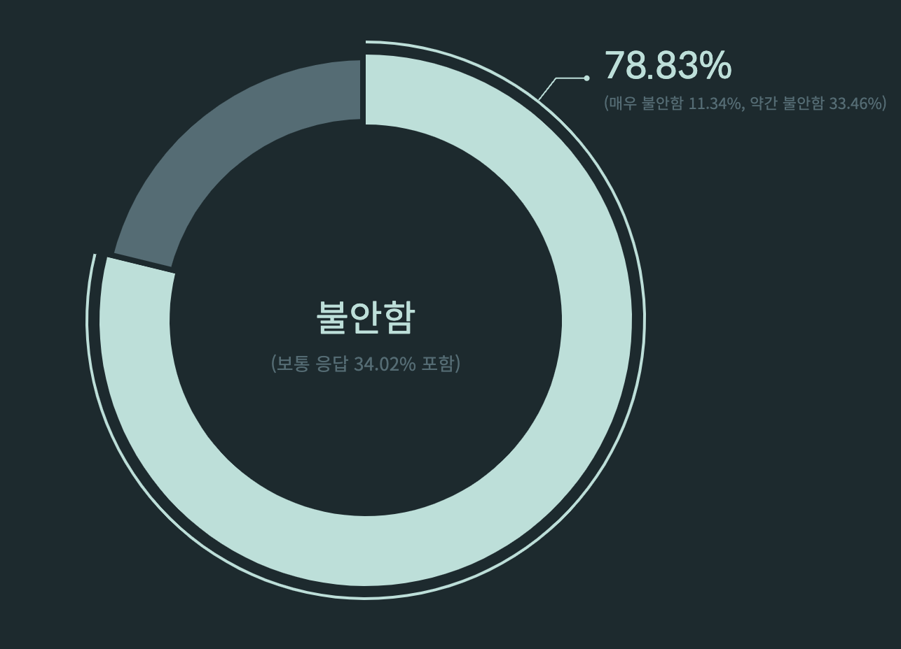
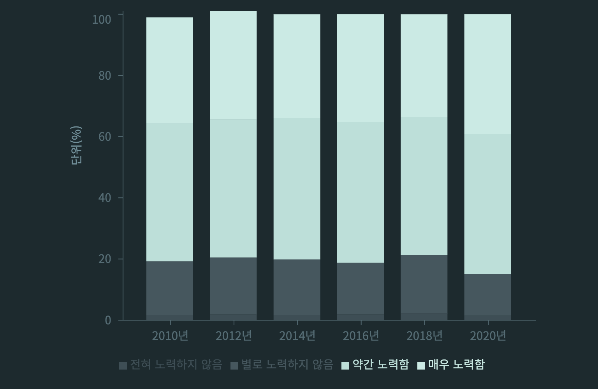
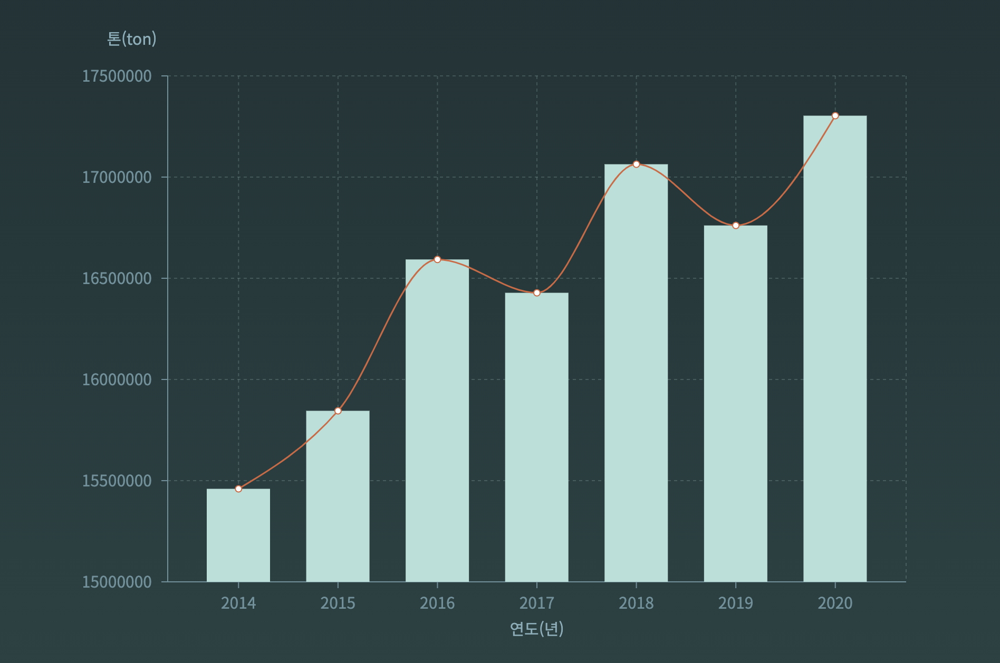
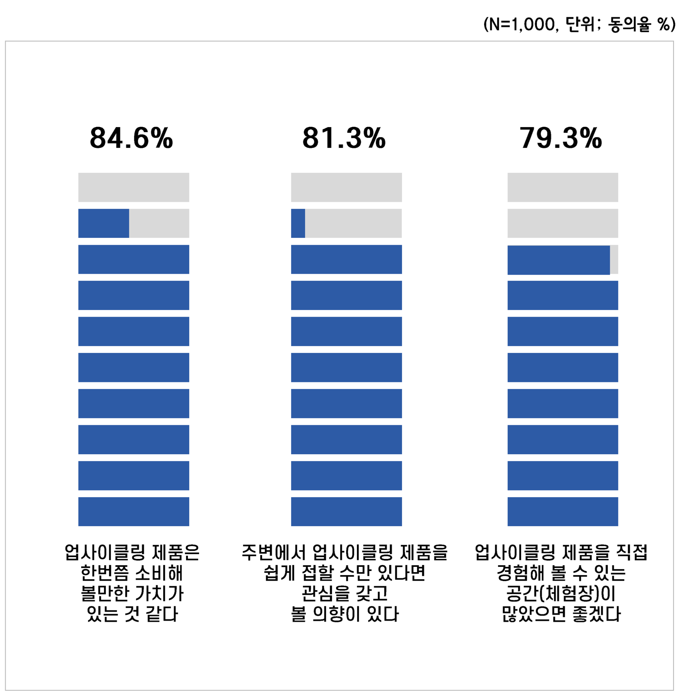

<h1 style="font-family:SANGJUGyeongcheonIsland;font-size: 50px;color:#000">"다시, 다"</h1>

# 목차
1. [소개](#📋소개)

2. [기획서](#📜기획서)
    - [문제인식](#문제인식)
    - [문제해결](#기획의도문제해결) 

3. [프로젝트 소개](#프로젝트-소개)
    - [주요기능](#주요-기능)
    - [기대효과](#기대효과)
    - [추후 기능 목표](#추후-기능-목표)

4. [폴더구조](#폴더구조)

5. [팀원소개](#팀원-소개)

# 📋소개
생활 쓰레기 배출량을 줄이기 위해 업사이클링을 권장하는 <strong style="font-family:SANGJUGyeongcheonIsland;font-size: 20px;color:#000;border-radius:3px;">"다시, 다"</strong>프로젝트입니다

팀 소개를 먼저 하겠습니다 프로젝트명 <strong style="font-family:SANGJUGyeongcheonIsland;font-size: 20px;color:#000">"다시, 다"</strong>는 모든 것들을 다시 사용해보자라는 의미를 담은 이름입니다

이번 프로젝트에서는 업사이클링을 권장하는 서비스를 제공합니다

## 사용 기술
`Front-End` 


---
`Back-End`


---
`Data-Analysis`


--- 


# 📜기획서

-  ## 문제인식

    국내 생활쓰레기 배출량은 매년 꾸준히 증가하고있습니다. 그 원인에는 다양한 이유들이 있겠지만 짦은 유행과 그에 따른 소비 트렌드 변화,배달/택배 서비스 등의 증가로 인한 일회용 쓰레기의 증가 등을 생각해볼 수 있습니다.

    

        사람들은 현재 환경문제에 대한 불안감이 높은 편으로 나타납니다

    

        사람들이 환경문제에 대해 불안감을 가지고 있고, 그만큼 환경문제에 관심을 가지고 노력하느 사람이 많아지고 있다는 것을 알 수 있습니다.

    

        그럼에도 불구하고 우리나라 생활쓰레기 배출량을 점점 증가하고 있습니다

    기업차원에서도 환경문제에 대해 해결하고 캠페인 등을 진행하고 있지만 개인적인 차원에서 해결할 수 있는 방안이 별로 알려지지않고 진행되지 않고있습니다.

    사람들에게 환경문제가 얼마나 심각하고 해결방안으로는 개인이 할 수 있는 것이 무엇인지 알려줄 필요가있다고 생각이 들었습니다

- ## 기획의도(문제해결)
    **업사이클링**은 리사이클링(재활용)보다 확장된 개념으로 버려지는 제품을 기능성과 심미성을 갖춘, 새로운 차원의 부가가치를 지닌 제품으로 재탄생 시키는 것입니다.
 
    전세계적으로 볼 때 우리나라는 업사이클링에 대한 인지도가 낮고 업사이클 시장규모도 작습니다. 시장규모는 증가해왔으나 다른 선진국들과 비교하면 그 수치는 매우 작습니다.

    


    
    출처:트렌드모니터

    <br/>

        하지만 주변에서 쉽게 접할 수 있다면 관심을 갖고 볼 의향이 있다고 응답한 사람들이 많다는 것을 알 수 있습니다.


    업사이클링이라는 개념 인지자의 대다수가 관심은 있지만, 일상에서 적극적으로 실천은 하지 못하고 있는 모습을 보입니다.

    이는 업사이클링 제품에 대한 호기심이 있어도 제품을 주변에서 쉽게 체험해보기가 힘들기 떄문으로 보여집니다

    업사이클링 제품의 접근성을 높인다면 관심도도 높아져 환경문제에 대해 많은 도움이 될 것으로 예상됩니다.
    
    그래서 우리는 사람들이 업사이클링이라는 것에 좀 더 쉽게 접근할 수 있도록 우리에게 친근한 sns형식으로 업사이클링에 대한 정보를 공유하고, 캠페인을 열어 사람들에게 업사이클링을 알리는 서비스가 필요하다고 생각합니다

---
# 프로젝트 소개

- ## 주요 기능
    - 피드

        * 자신의 업사이클링 아이디어와 제품을 공유
        * 좋아요기능
        * 팔로우 기능 (해당 게시글 작성자를 팔로우하여 지속적으로 해당 작성자 게시글 중점으로 볼 수 있는 기능)
        * 업사이클링과 관련 클래스(동영상) 보기
    - 캠페인
        * 캠페인 게시글 생성
        * 좋아요 기능
        * 참여기능 (모집인원 초과시 참여 불가눙)

    ### 기대효과
    사람들이 업사이클링에 쉽게 접근하고 물품들을 보면서 관심도가 올라가 업사이클링 제품을 사용하고 업사이클링을 많이 참여할 것 이라고 예상됩니다.
    
    ### 추후 기능 목표

    * 알림기능
    * 게시글 신고 기능
    * 무한 스크롤

---

# 폴더구조

```
🖥 front
├─ 📁node_modules
├─ 📁public
└─ 📁src 
   ├─ 📁api
   ├─ 📁assets
   │  ├─ 📁fonts
   │  └─ 📁images
   ├─ 📁atoms
   ├─ 📁components
   │  ├─ 📁CampaignItems
   │  ├─ 📁Comment
   │  ├─ 📁common
   │  ├─ 📁Feed
   │  ├─ 📁Footer
   │  ├─ 📁Header
   │  ├─ 📁Landing
   │  ├─ 📁Login
   │  ├─ 📁Main
   │  ├─ 📁Nav
   │  ├─ 📁Profile
   │  └─ 📁Register
   ├─ 📁constant
   ├─ 📁hoc
   ├─ 📁pages
   │  ├─ 📁CampaignPage
   │  ├─ 📁FeedPage
   │  ├─ 📁LandingPage
   │  ├─ 📁LoginPage
   │  ├─ 📁MainPage
   │  ├─ 📁ProfilePage
   │  └─ 📁RegisterPage
   ├─ 📁styles
   ├─ 📁types
   └─ 📁utils
```

# 팀원 소개 

|이름|담당업무|개발파트|
| :---: | :---:| :---:|
|정소희|팀장/프론트엔드/디자인|User MVP|
|오다현|프론트엔드/데이터분석|Feed MVP|
|김경원|프론트엔드/데이터분석|Campaign MVP|
|한동룡|프론트엔드/디자인|Campaign MVP|
|신채민|백엔드/데이터분석|Feed,User MVP|
|이재희|백엔드/데이터분석|Campaign,User MVP|

# FAQ